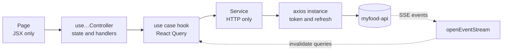

# MyFood Dashboard


Web dashboard of **MyFood**, an iFood-style food delivery platform. Restaurant owners register their
business, build the menu, run the order board in real time, manage their drivers and follow sales.

| Repository | What it is |
|---|---|
| [myfood-api](https://github.com/pedrohdionisio/myfood-api) | Fastify REST API, background workers and AWS Lambdas |
| **myfood-dashboard** (this one) | React dashboard for restaurant owners |
| [myfood-app](https://github.com/pedrohdionisio/myfood-app) | React Native (Expo) app for customers and drivers |

## Contents

- [What an owner can do](#what-an-owner-can-do)
- [Highlights](#highlights)
- [Architecture](#architecture)
- [Running locally](#running-locally)
- [Project layout](#project-layout)
- [Stack](#stack)

## What an owner can do

- **Onboard a restaurant** in steps — business details with address autocomplete by postal code
  (ViaCEP), opening hours, cuisines — guided by an activation checklist that shows what is still
  missing before the store can go live.
- **Run several restaurants** from one account and switch between them.
- **Build the menu**: categories and products with drag-and-drop ordering, a sold-out switch, and
  photos cropped in the browser and uploaded straight to S3.
- **Work the order board**: orders arrive in real time, move through accept → preparing → ready →
  out for delivery, and are dispatched to one of the restaurant's drivers.
- **Follow the business**: revenue, order volume, preparation time and best-selling products per
  day, plus the full order history.
- **Manage the team**: create driver accounts, promote a driver to owner or back, and deactivate
  access immediately.
- **Answer reviews** from customers.
- **Pause the store** without touching the opening hours.

Drivers sign in with the same account type but work from the mobile app; the dashboard tells them
where to go instead of showing an empty screen.

## Highlights

- **Real-time order board over SSE.** `EventSource` cannot send an `Authorization` header, so the
  stream runs on a fetch-based client (`data/libs/openEventStream.ts`) with the server's retry hint,
  exponential backoff and token renewal. Each event only invalidates the React Query cache; the
  order itself is always refetched from the REST route.
- **Silent session refresh.** An axios interceptor catches a `401`, refreshes the session once —
  concurrent requests wait on the same refresh instead of racing — and replays them.
- **One source of truth for messages.** Forms validate with Zod before anything leaves the browser,
  and API errors are shown with the message the API wrote for users, so the dashboard and the app
  say the same thing.
- **Images sized for the backend pipeline.** Product photos are exported at 1280×960 WebP — the
  width of the largest variant the API's image Lambda produces — so nothing is upscaled or wasted.
- **Quality gate on every commit.** Husky and lint-staged run Biome with warnings as errors and the
  TypeScript build; code that does not pass does not get committed.

## Architecture

Three layers at the top of `src/`, each with its own import alias:

| Layer | Responsibility |
|---|---|
| `data/` | Everything outside the browser: API services, React Query use cases, DTOs, storage, the SSE client |
| `presentation/` | Pages, components and their controllers |
| `shared/` | Routes, entities, constants, utilities and hooks used across the app |

Each API resource is a module under `data/modules/<resource>/` with the same shape: a `services/`
file that only talks HTTP, `useCases/` hooks that wrap it in React Query, `keys/` for the query
keys and `types/` for the DTOs. A page never calls axios or React Query directly — its controller
hook goes through the use cases.



## Running locally

Requirements: Node.js 22+, pnpm, and a running [myfood-api](https://github.com/pedrohdionisio/myfood-api).

```bash
pnpm install
cp .env.example .env     # VITE_API_URL points to the API, http://localhost:3333 by default
pnpm dev
```

| Script | What it does |
|---|---|
| `pnpm dev` | Vite dev server |
| `pnpm build` | Type-check and production build |
| `pnpm typecheck` | `tsc -b` |
| `pnpm lint` · `pnpm format` | Biome check, and check with fixes |
| `pnpm test` · `pnpm test:coverage` | Vitest unit and feature tests, with coverage thresholds |
| `pnpm test:e2e` | Playwright on Chromium and WebKit, against a production build and a mocked API |

The API's seed (`pnpm db:seed` in myfood-api) creates restaurants, owners and 60 days of order
history, so the analytics have something to show.

## Project layout

```
src/
  data/
    config/        axios instance, React Query client, ViaCEP client, environment
    contexts/      authentication and the selected restaurant
    libs/          token storage and the SSE client
    modules/       one folder per API resource: services, useCases, keys, types
  presentation/
    pages/         one folder per screen, with its controller and components
    components/    shared UI built on Radix and shadcn tokens
    templates/     dashboard and onboarding layouts
  shared/
    routes/        signed-in and signed-out routers
    entities/  constants/  hooks/  utils/
```

The interface is in Portuguese, for the Brazilian market. Code, identifiers and documentation are in
English.

## Stack

React 19 · TypeScript · Vite 8 · Tailwind CSS 4 with shadcn tokens · Radix UI · React Router ·
TanStack Query · axios · React Hook Form · Zod · Recharts · dnd-kit · react-easy-crop · Biome ·
Husky + lint-staged

## Author

**Pedro Henrique Dionisio** — [LinkedIn](https://www.linkedin.com/in/pedrohenriquedionisio/)

## License

[MIT](LICENSE)
